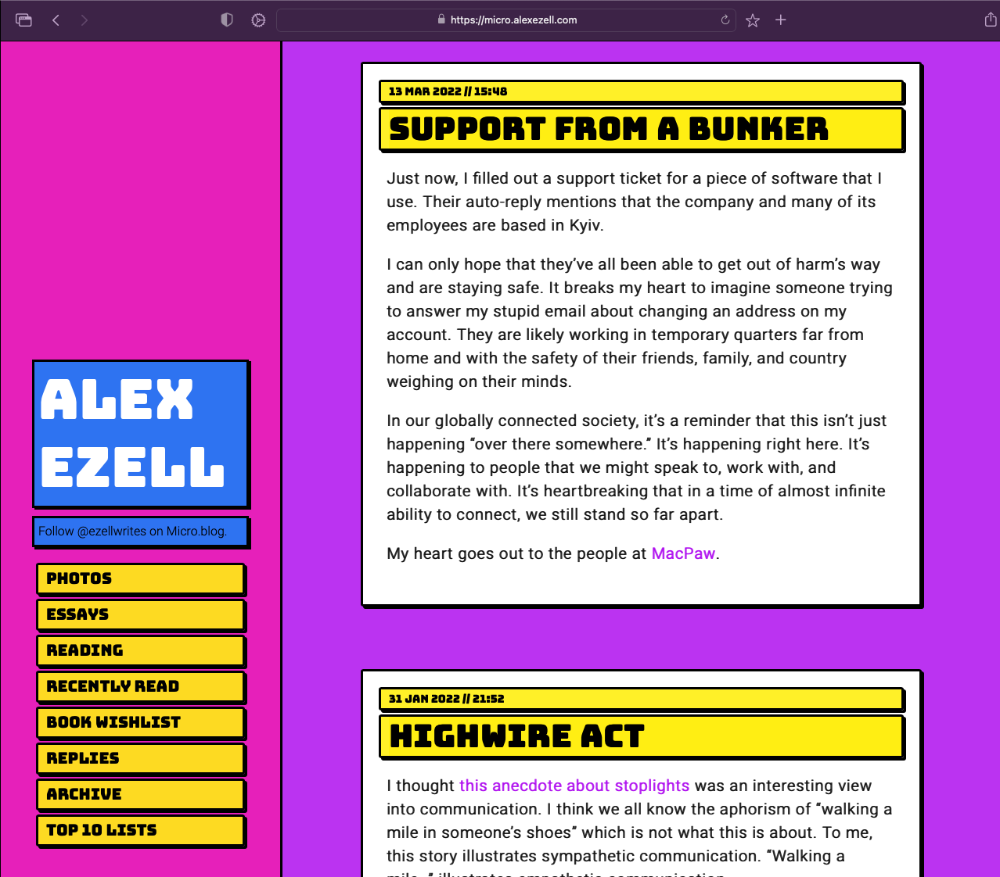

# Vapor1994

Vapor1994 is a two-column theme for micro.blog sites.

## Contents

- [Why?](#why)
- [Screenshot](#screenshot)
- [Usage](#usage)
- [Author](#author)
- [License](#license)

## Why?

I was inspired to create this theme due to my secret love for the Vaporwave/AMV music scene and aesthetics while also combining some ideas from the [Neubrutalism](https://hype4.academy/articles/design/neubrutalism-is-taking-over-web) trend.

## Screenshot

This is what Vapor1994 looks like on [my blog](https://micro.alexezell.com).

## Usage

To install Vapor1994 on your micro.blog site, just use this repository's URL in the Design section of your site. You might also find it listed in the Plug-ins Directory at micro.blog.

## Author

**Alex Ezell**

- <https://github.com/aezell>
- <https://micro.alexezell.com>

My dumb modifications of stellar work by:

**Mark Otto**

- <https://github.com/mdo>
- <https://twitter.com/mdo>

## License

Open sourced under the [MIT license](LICENSE.md) as licensed by Mark Otto.

<3
